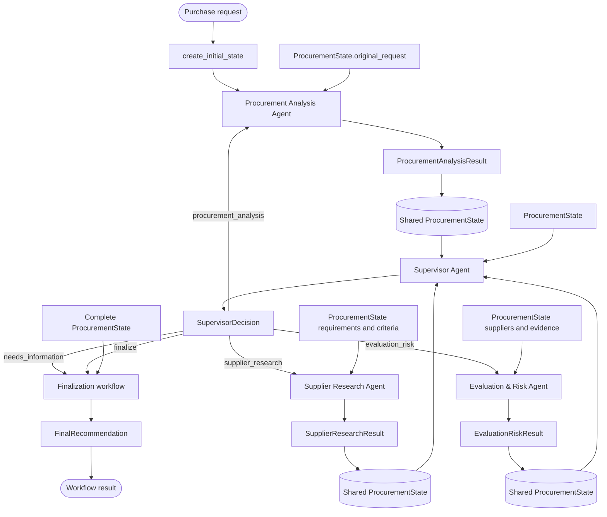

# Agent Flow

This document explains how the Pydantic models, shared `ProcurementState`, and
agent nodes fit together.

The central rule is:

```text
Agents do not call other agents.
Agents read ProcurementState, return a Pydantic result, and update the state.
The supervisor decides which agent runs next.
```

## 1. Complete Flow



## 2. Shared State

`ProcurementState` is the persistent working memory for one procurement run.
Every agent sees the state produced by the previous step.

```python
ProcurementState(
    request_id=str,
    original_request=ProcurementRequest,
    requirements=ProcurementRequirements | None,
    missing_information=list[str],
    applicable_policies=list[str],
    evaluation_criteria=list[EvaluationCriterion],
    supplier_candidates=list[SupplierCandidate],
    historical_tenders=list[dict],
    supplier_evaluations=list[EvaluationResult],
    risks=list[RiskApprovalResult],
    approval_required=bool | None,
    evidence=list[dict],
    agent_history=list[dict],
    next_action=str | None,
    status=str,
    final_recommendation=FinalRecommendation | None,
)
```

The state is not replaced by every agent. A node returns a partial update, and
the graph merges that update into the existing state.

## 3. Initial Request

### Input model

```python
ProcurementRequest
```

This is the unprocessed request submitted by the requester.

Example:

```python
ProcurementRequest(
    requester="IT Department",
    item="Business laptops",
    quantity=40,
    budget_eur=45000,
    location="Barcelona, Spain",
    delivery_deadline_days=21,
    requirements=[
        "16 GB RAM minimum",
        "3-year warranty",
    ],
)
```

`create_initial_state` wraps this request in a new `ProcurementState`.

At this point, the workflow has a request but no analysis, suppliers,
evaluations, or risk findings.

## 4. Procurement Analysis Agent

### Purpose

Convert the unstructured procurement request into structured facts and identify
what information is missing before further investigation.

This agent is the first reasoning step because later agents need to know what
is being purchased and how candidates should be evaluated.

### Effective input

The node receives the complete `ProcurementState`, but it primarily uses:

```python
state.original_request: ProcurementRequest
```

The other state fields are normally empty at this stage.

### Output model

```python
ProcurementAnalysisResult(
    requirements=ProcurementRequirements,
    missing_information=list[str],
    applicable_policies=list[str],
    evaluation_criteria=list[EvaluationCriterion],
    evidence=list[dict],
)
```

### Output meaning

- `requirements` contains the extracted procurement facts.
- `missing_information` contains information needed to continue reliably.
- `applicable_policies` identifies relevant policy areas.
- `evaluation_criteria` defines how supplier options should be compared.
- `evidence` records supporting sources returned by policy retrieval.

### State update

The result updates:

```text
requirements
missing_information
applicable_policies
evidence
```

The analysis agent does not choose the next agent. It returns control to the
supervisor.

## 5. Supervisor Agent

### Purpose

Inspect the current state and decide what should happen next.

The supervisor is the orchestrator, not a procurement specialist. It should
not extract requirements, search suppliers, or calculate scores itself.

### Input

```python
ProcurementState
```

The supervisor uses the current state to determine which stages are complete
and which stage is needed next.

### Output model

```python
SupervisorDecision(
    next_action=(
        "procurement_analysis"
        | "supplier_research"
        | "evaluation_risk"
        | "finalize"
        | "needs_information"
    ),
    reason=str,
)
```

### Routing decisions

| State condition | Next action | Why |
|---|---|---|
| Important request information is missing | `needs_information` | A reliable investigation cannot continue. |
| Requirements or policy analysis is incomplete | `procurement_analysis` | The workflow needs a better understanding of the request. |
| No supplier candidates or market evidence exists | `supplier_research` | Candidates must be found before comparison. |
| Candidates exist but have not been compared | `evaluation_risk` | Supplier evidence must be evaluated. |
| Evaluation lacks evidence | `supplier_research` | The workflow needs another research pass. |
| Suppliers are evaluated but risks are not assessed | `evaluation_risk` | Risk and approval must be determined. |
| Required evidence and risk findings exist | `finalize` | A final recommendation can be built. |

### State update

The active routing value is stored in:

```python
state.next_action
```

The explanation in `SupervisorDecision.reason` is transient unless it is
recorded as an entry in `state.agent_history`.

## 6. Supplier Research Agent

### Purpose

Find supplier candidates and historical procurement evidence relevant to the
requirements.

This agent may run more than once. The supervisor sends the workflow back here
when evaluation shows that evidence is insufficient.

### Effective input

The node receives `ProcurementState`, primarily using:

```python
state.requirements: ProcurementRequirements
state.evaluation_criteria: list[EvaluationCriterion]
state.supplier_candidates: list[SupplierCandidate]
state.historical_tenders: list[dict]
```

On a repeated pass, existing candidates and tenders tell the agent what is
already known and what still needs investigation.

### Output model

```python
SupplierResearchResult(
    supplier_candidates=list[SupplierCandidate],
    historical_tenders=list[dict],
    missing_information=list[str],
    evidence=list[dict],
    research_completed=bool,
)
```

### State update

The result updates:

```text
supplier_candidates
historical_tenders
missing_information
evidence
```

`research_completed` describes the agent result. It is not a separate
`ProcurementState` field; the supervisor can infer completion from the state.

## 7. Evaluation & Risk Agent

### Purpose

Compare supplier candidates, calculate scores, assess risk, and determine
whether approval is required.

This agent combines evaluation and risk because both depend on the same body of
supplier and policy evidence.

### Effective input

The node receives `ProcurementState`, primarily using:

```python
state.requirements: ProcurementRequirements
state.evaluation_criteria: list[EvaluationCriterion]
state.supplier_candidates: list[SupplierCandidate]
state.applicable_policies: list[str]
state.evidence: list[dict]
```

On a repeated pass, it also uses existing `supplier_evaluations` and `risks`.

### Output model

```python
EvaluationRiskResult(
    supplier_evaluations=list[EvaluationResult],
    risks=list[RiskApprovalResult],
    approval_required=bool | None,
)
```

### Output meaning

- `supplier_evaluations` records each candidate’s compliance, score, strengths,
  weaknesses, and missing evidence.
- `risks` records structured risk and approval findings.
- `approval_required` is a convenient state-level summary.

### State update

The result updates:

```text
supplier_evaluations
risks
approval_required
```

If the evaluation finds insufficient supplier evidence, the supervisor routes
the workflow back to `supplier_research`.

## 8. Finalization Workflow

Finalization is a workflow function, not an agent. It does not perform new
research or make a new decision. It assembles the accumulated state into the
public result.

### Input

```python
ProcurementState
```

The state should contain enough requirements, supplier evidence, evaluations,
and risk findings for a recommendation.

### Output model

```python
FinalRecommendation(
    request_id=str,
    status=(
        "READY_TO_PROCEED"
        | "HUMAN_REVIEW_REQUIRED"
        | "NEEDS_INFORMATION"
    ),
    summary=str,
    requirements=ProcurementRequirements,
    suppliers_considered=list[SupplierCandidate],
    recommended_option=dict | None,
    evaluation=list[EvaluationResult],
    risk=RiskApprovalResult,
    approval=dict,
    evidence=list[dict],
    unresolved_questions=list[str],
    recommendation=str,
)
```

### Final statuses

- `NEEDS_INFORMATION`: the request cannot be evaluated reliably.
- `HUMAN_REVIEW_REQUIRED`: analysis is complete but approval or review is
  required.
- `READY_TO_PROCEED`: analysis is complete and no configured review condition
  was triggered.

## 9. State Transition Summary

```text
ProcurementRequest
    -> create_initial_state
ProcurementState
    -> ProcurementAnalysisResult
ProcurementState updated with requirements and criteria
    -> SupervisorDecision
SupervisorDecision
    -> SupplierResearchResult
ProcurementState updated with suppliers and evidence
    -> SupervisorDecision
SupervisorDecision
    -> EvaluationRiskResult
ProcurementState updated with evaluations and risks
    -> SupervisorDecision
SupervisorDecision
    -> FinalRecommendation
```

The supervisor can repeat the supplier-research and evaluation stages. This is
the part that makes the workflow multi-agent and iterative rather than a fixed
one-pass pipeline.

## 10. Model Responsibilities

| Model | Responsibility |
|---|---|
| `ProcurementRequest` | Original user request. |
| `ProcurementRequirements` | Extracted procurement facts. |
| `EvaluationCriterion` | A weighted comparison criterion. |
| `SupplierCandidate` | One possible supplier and its evidence. |
| `EvaluationResult` | One supplier’s evaluation. |
| `RiskApprovalResult` | Risk and approval findings. |
| `ProcurementAnalysisResult` | Analysis agent output. |
| `SupplierResearchResult` | Supplier research agent output. |
| `EvaluationRiskResult` | Evaluation and risk agent output. |
| `SupervisorDecision` | Supervisor routing output. |
| `FinalRecommendation` | Final user-facing workflow result. |
| `ProcurementState` | Shared working memory between all steps. |

The output models describe what an agent has just produced. `ProcurementState`
describes what the workflow remembers between agents.
