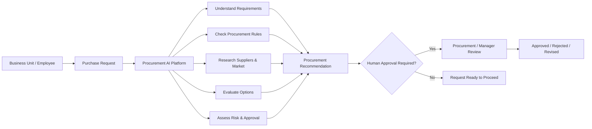
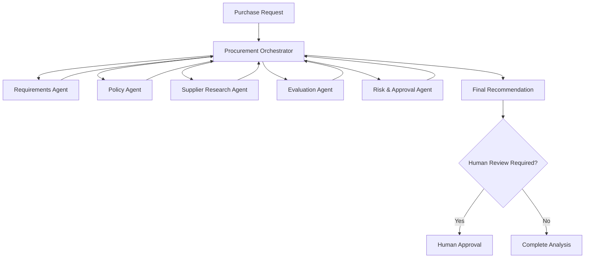
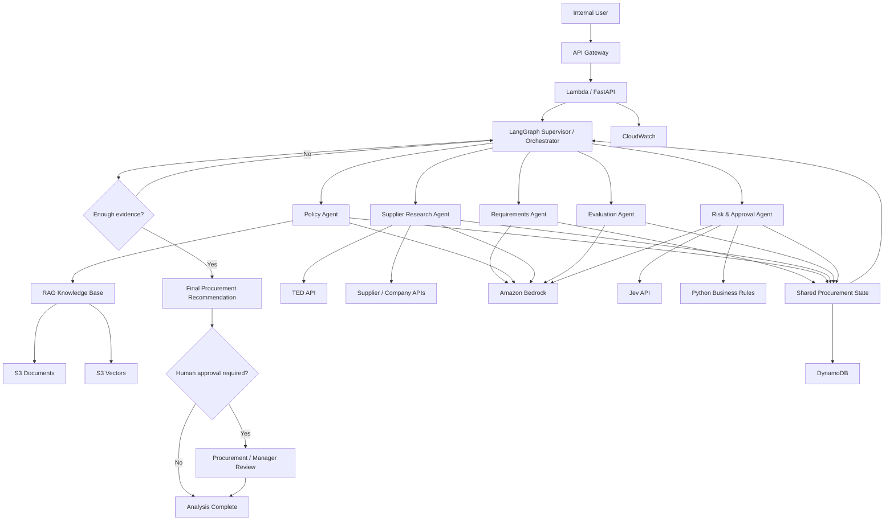
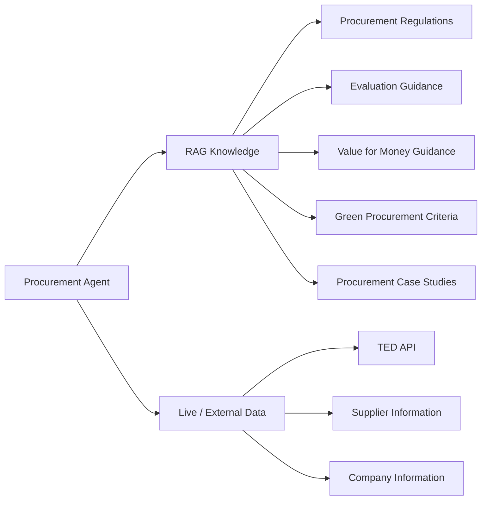

# Architecture

## 1. Business Architecture

The Procurement Operations Agent supports internal procurement teams throughout the early stages of a purchase request.

An employee or business unit submits a procurement need. The platform investigates the request, checks applicable procurement guidance, searches the supplier market and historical tenders, evaluates available options, and determines whether the request can proceed or requires human review.

### Example

A department submits:

> We need 40 laptops for our Barcelona office with a maximum budget of €45,000 and delivery within three weeks.

The platform may:

1. Extract the requirements.
2. Determine which procurement rules and evaluation criteria apply.
3. Investigate previous comparable procurements.
4. Search for relevant suppliers.
5. Compare supplier options.
6. Identify risks or missing information.
7. Produce an evidence-backed recommendation.
8. Escalate the request when human approval is required.

The platform acts as an **AI procurement analyst**, not an autonomous purchasing system.

---

# 2. Multi-Agent Architecture

The platform uses specialized agents coordinated by a central orchestration layer.

### Agent Responsibilities

**Procurement Orchestrator**

Coordinates the workflow, maintains state and decides which specialist agent should execute next.

**Requirements Agent**

Extracts and structures information such as:

* product or service required
* quantity
* budget
* delivery constraints
* technical requirements
* missing information

**Policy Agent**

Uses RAG to retrieve relevant procurement rules, evaluation guidance and sustainability criteria.

**Supplier Research Agent**

Searches external procurement and supplier sources, including historical tenders from TED.

**Evaluation Agent**

Compares candidate suppliers and procurement options using price and non-price criteria.

**Risk & Approval Agent**

Evaluates risk, uncertainty and approval requirements using deterministic rules and Jev-based structured decisions.

---

# 3. Technical Architecture

---

# 4. Technology Responsibilities

| Component               | Responsibility                                    |
| ----------------------- | ------------------------------------------------- |
| Python                  | Core application and deterministic business logic |
| FastAPI                 | Application API                                   |
| LangGraph               | Multi-agent orchestration and state transitions   |
| LangChain               | LLM, retrieval and tool integrations              |
| Amazon Bedrock          | LLM reasoning and embeddings                      |
| Bedrock Knowledge Bases | RAG retrieval                                     |
| S3                      | Procurement source documents                      |
| S3 Vectors              | Vector storage                                    |
| TED API                 | Historical and current public procurement data    |
| Jev                     | Structured AI decisions                           |
| DynamoDB                | Procurement requests, workflow state and results  |
| Lambda                  | Serverless application execution                  |
| API Gateway             | Public API endpoint                               |
| CloudWatch              | Logging and monitoring                            |
| Docker                  | Local development and reproducible environments   |
| GitHub Actions          | Testing and CI/CD                                 |
| Terraform               | Infrastructure as Code in a later phase           |

---

# 5. Data Separation

The platform distinguishes between knowledge that should be indexed and information that should be retrieved dynamically.

RAG answers questions such as:

> What rules or evaluation criteria apply?

External tools answer questions such as:

> Which suppliers or comparable procurements currently exist?

---

# 6. Design Principles

The initial architecture follows several constraints:

* Serverless-first AWS architecture to minimize idle cost.
* Multiple specialized agents rather than one unrestricted agent.
* Human approval for consequential procurement decisions.
* Public, real-world procurement data wherever possible.
* Clear separation between LLM reasoning and deterministic business rules.
* Evidence-backed recommendations with traceable sources.
* Agents may investigate and recommend, but V1 will not autonomously place purchase orders.
